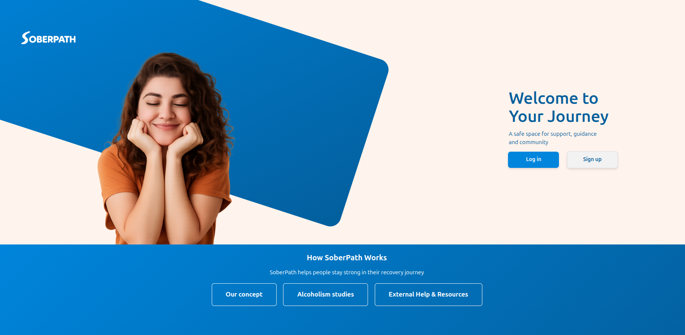
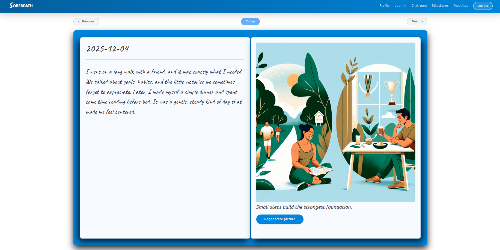

<!-- ============================
  GitHub Profile README
  Andi Messingschlager (Sirprise2493)
  ============================ -->

  

  
  
  

  

---

## 🧩 About me (quick but real)
I’m **Andi**, a **Full Stack Developer** and **Le Wagon Web Dev Bootcamp graduate**.  
I like building products that feel calm, useful, and reliable — the kind you’d actually keep using after day 1.

Right now I’m looking for a **Full Stack role in Germany (Hybrid)** where I can work balanced across **backend + frontend** and ship features end-to-end.

- 🧠 I enjoy the “hard parts”: architecture, debugging, reliability  
- 🤝 Team-first, feedback-friendly (I’ve led a 4-person dev team)  
- 🛠️ I ship with empathy: for users *and* future developers  

---

## 🎯 What I’m looking for
- **Role:** Junior / Entry Full Stack Developer  
- **Work style:** **DE — Hybrid**  
- **Focus:** Rails + React + SQL  
- **Bonus:** AI integrations, real users, teams that ship  

---

## 📌 Pinned Projects
- 🍃 **SoberPath** — AI + community support web app (**live**)  
  → https://sober-path.com  
- 🗨️ **Plauder** — mobile-first social chat (**in progress**)  
  → https://github.com/Sirprise2493/plauder  
- 🏠 **AirBnB Clone** — full stack fundamentals  
  → https://github.com/Sirprise2493/AirBnB  

---

## 🌟 Featured Project

### 🍃 SoberPath — support system for people with alcohol addiction  
**Live:** https://sober-path.com  

I was **Team Lead** in a 4-person team and owned most of the **server-side implementation**.

**What I built / owned**
- 📝 **AI-assisted journal** (OpenAI integration)  
- 💬 **Chat area with AI connection**  
- 🗺️ **Discover real-life meetings** via location-based features  
- 🧯 Stabilized a fragile **AI image generation** section by root-cause analysis  

**Tech Stack (clean + readable)**
- **Backend:** Ruby on Rails • PostgreSQL  
- **Frontend:** Stimulus • SCSS (and modern JS where needed)  
- **Realtime:** WebSockets • Turbo Streams  
- **AI:** OpenAI API  

---

## 🖼️ Screenshots (GitHub-safe “slider”)
GitHub READMEs can’t run real JavaScript sliders — but this feels like one: **click to expand** 👇

  
<b>📸 Open SoberPath gallery</b> (click)

   

  

    
  

  

    
  

  

    
  

  

    Tip: Replace with .jpg/.png filenames exactly as in <code>assets/</code>.
  

<!-- Optional: compact preview row -->

  
  
  

---

## 🧰 Tech Stack (what I actually use)

  

### 📊 Skills (clean progress bars)
> Just a practical snapshot — not “levels”, just where I feel strongest.

**Ruby on Rails**
<progress value="90" max="100"></progress>

**JavaScript / React**
<progress value="80" max="100"></progress>

**SQL (PostgreSQL)**
<progress value="80" max="100"></progress>

**HTML / CSS**
<progress value="75" max="100"></progress>

**Python / Java / C++**
<progress value="65" max="100"></progress>

---

## 📈 Stats (optional but fun)

  

  

---

## 🐍 Contribution Snake (animated)

  

---

## 🤝 Let’s connect
- 💼 **LinkedIn:** https://www.linkedin.com/in/andi-messingschlager-full-stack-developer/  
- 📬 **Email:** andi.webdes@gmail.com  

✨ Built with curiosity, caffeine, and a stubborn love for shipping.
